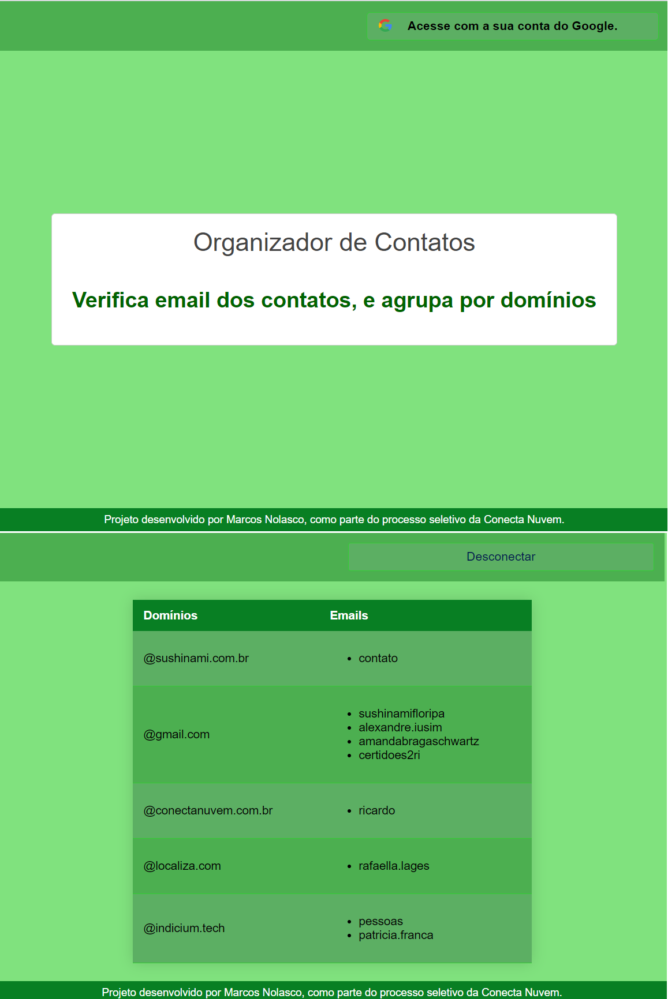

<<<<<<< HEAD

<h1 > Organizador de Contatos </h1>
<h2 > Aplicação que lê os contatos do usuário e organiza seus emails de acordo com os domínios. </h2>


## Construída com Vue.js e utilizando a People API do Google.

<h4> 
	 🚀 Em processo de produção...  🚧
</h4>

<h1 align="center">
  
</h1>

## Para clonar este projeto, é necessário ter Node.js 14+, Vue.js 2+, e uma conta Google.

### Clone este repositório

git clone <https://github.com/caro-marks/organizador-contatos>

### Acesse a pasta do projeto no terminal/cmd

`cd organizador-contatos`

### Instale as dependências

=======

<h1 > Organizador de Contatos </h1>
<h2 > Aplicação que lê os contatos do usuário e organiza seus emails de acordo com os domínios. </h2>


## Construída com Vue.js e utilizando a People API do Google.

### Project setup

> > > > > > > 3b2e2df6c7221c1133f72db7514f5235df25dba5

```
npm install
```

### Execute a aplicação em modo de desenvolvimento

```
npm run dev
```

#### O servidor inciará na porta:8080 - acesse <http://localhost:8080>

### 🛠 Tecnologias

As seguintes ferramentas foram usadas na construção do projeto:

- [Vue](https://cli.vuejs.org/)
- [Node.js](https://nodejs.org/)

### <a>🚀Feito por</a>

<a href="https://www.linkedin.com/in/caro-marks">
   <b>Marcos Nolasco</b> 👋🏽
</a>

---
